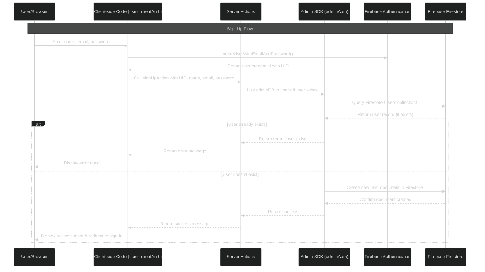
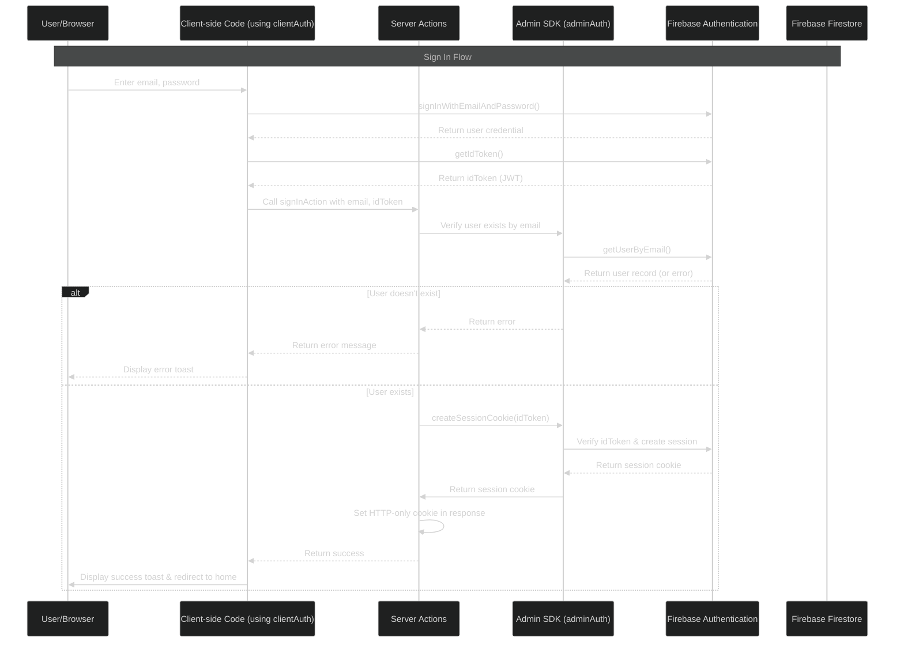
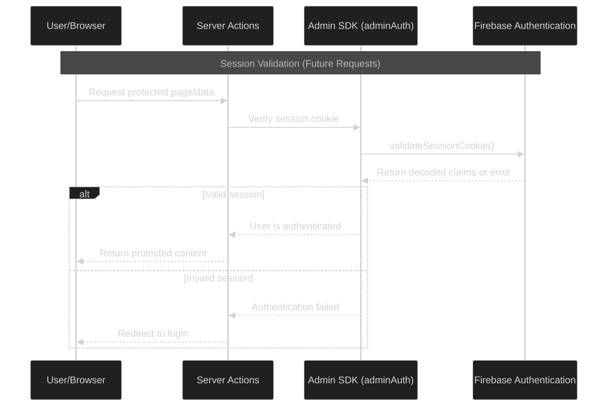

# 🤖 IntervueAI - Precision in Recruitment 


## 🌟 Overview
The **IntervueAI** is a next-gen AI-powered mock interview platform built to help students and professionals prepare for interviews in a way that actually feels real. It goes beyond generic questions using your resume, job role, and round type to generate personalized, industry-relevant interviews.

  What makes IntervueAI special is its ability to give smart, AI-generated feedback after each session including performance insights, improvement tips, and evaluation reports so you’re not just practicing, you’re leveling up.

  ## 🔒 Authentication Flow

VoxNavi uses Firebase Authentication with secure session cookies for enhanced security:

- Server-side session validation
- HTTP-only cookies
- Session expiration and automatic renewal

## User Authentication using Firebase Auth


## Frontend


### Sign Up Flow



### Sign In Flow



### Session Validation Flow (Future Requests)



## Detailed Auth Explanations

### Sign Up Process:

1. User enters their information in the AuthForm component
2. Client-side Firebase creates the auth record via `createUserWithEmailAndPassword`
3. You get a user credential with a UID from Firebase Authentication
4. The server action `signUpAction` then stores additional user information in Firestore
5. If successful, user is redirected to sign in

### Sign In Process:

1. User enters email/password in the AuthForm
2. Client-side Firebase authenticates via `signInWithEmailAndPassword`
3. You request an ID token (JWT) from the authenticated user
4. The server action `signInAction` verifies the user and creates a session cookie
5. This cookie is set in the HTTP response as an HTTP-only cookie
6. Future requests will include this cookie automatically, authenticating the user

### What is the ID Token (`idToken`)?

The ID token is a JWT (JSON Web Token) that:

- Is created by Firebase when a user authenticates
- Contains the user's identity information
- Is cryptographically signed to verify authenticity
- Is short-lived (usually 1 hour)
- Gets exchanged on the server for a longer-lived session cookie

## 📊 Interview and Feedback System

1. **Interview Generation**:

   - Custom interviews based on job role, experience level, and tech stack
   - Questions generated using AI models

2. **Voice Interview Process**:

   - Real-time voice interaction with the AI assistant
   - Transcript recording for feedback generation

3. **Feedback Analysis**:
   - Multiple performance categories assessment
   - Strengths and areas for improvement
   - Overall score and detailed recommendations

## 🤝 Contributing

Contributions are welcome! Please feel free to submit a Pull Request.

1. Fork the repository
2. Create your feature branch (`git checkout -b feature/amazing-feature`)
3. Commit your changes (`git commit -m 'Add some amazing feature'`)
4. Push to the branch (`git push origin feature/amazing-feature`)
5. Open a Pull Request

## 📝 License

This project is licensed under the Apache License 2.0 - see the [LICENSE](LICENSE) file for details.

## 🙏 Acknowledgements

- [Next.js](https://nextjs.org/)
- [Firebase](https://firebase.google.com/)
- [Vapi AI](https://vapi.ai/)
- [Google Gemini](https://ai.google.dev/)
- [shadcn/ui](https://ui.shadcn.com/)
- [Tailwind CSS](https://tailwindcss.com/)
- [Vercel](https://vercel.com/)

## ✨ Features
- 🔐 **User Authentication**
  - Sign Up and Sign In using password/email authentication handled by Firebase.

- 🎛️ **Interactive Dashboard**
  - Provides an intuitive interface for managing interview preparations.
    
- 🧑‍💻 **No Form-Based Flow**
  - Say goodbye to static input forms just log in, speak, and start your interview. It's natural, voice-first interaction from the start.

- 🤖 **AI-Powered Interview Generation**
  - Personalized mock interviews based on your resume, job role, and round type using Vapi voice assistants and Google Gemini.


- 🧠 **Digital AI Interviewers**
  - Interact with intelligent AI personas inspired by iconic digital characters, making practice more immersive and less robotic.

- 📝 **Real-Time Transcription**
  - Get instant AI-generated feedback after each session, including ratings, improvement tips, and evaluation summaries.


## 🛠️ Tech Stack
- ⚛ **Next.js**
- 🔥 **Firebase**
- 🎨 **Tailwind CSS**
- 🗣️ **Vapi AI**
- 🧩 **shadcn/ui**
- 🧠 **Google Gemini**


## <a name="quick-start">🤸 Quick Start</a>

Follow these steps to set up the project locally on your machine.


**Installation**

Install the project dependencies using npm:

```bash
npm install
```

**Set Up Environment Variables**

Create a new file named `.env.local` in the root of your project and add the following content:

```env
NEXT_PUBLIC_VAPI_WEB_TOKEN=
NEXT_PUBLIC_VAPI_WORKFLOW_ID=

GOOGLE_GENERATIVE_AI_API_KEY=

NEXT_PUBLIC_BASE_URL=

NEXT_PUBLIC_FIREBASE_API_KEY=
NEXT_PUBLIC_FIREBASE_AUTH_DOMAIN=
NEXT_PUBLIC_FIREBASE_PROJECT_ID=
NEXT_PUBLIC_FIREBASE_STORAGE_BUCKET=
NEXT_PUBLIC_FIREBASE_MESSAGING_SENDER_ID=
NEXT_PUBLIC_FIREBASE_APP_ID=

FIREBASE_PROJECT_ID=
FIREBASE_CLIENT_EMAIL=
FIREBASE_PRIVATE_KEY=
```

Replace the placeholder values with your actual **[Firebase](https://firebase.google.com/)**, **[Vapi](https://vapi.ai/?utm_source=youtube&utm_medium=video&utm_campaign=jsmastery_recruitingpractice&utm_content=paid_partner&utm_term=recruitingpractice)** credentials.

**Running the Project**

```bash
npm run dev
```

Open [http://localhost:3000](http://localhost:3000) in your browser to view the project.

## 🤝 Contributions
This project is **open-source forever!** Contributions are welcome. Feel free to:
- 🎨 Improve UI/UX
- 🧠 Optimize AI algorithms
- 🗄️ Enhance database efficiency
- 🚀 Add new features

Fork the repository, make changes, and submit a **pull request**!

## 📜 License
This project is licensed under the **MIT License**.

---

### **🎉 Happy Coding & Best of Luck for Your Interviews! 🚀**
